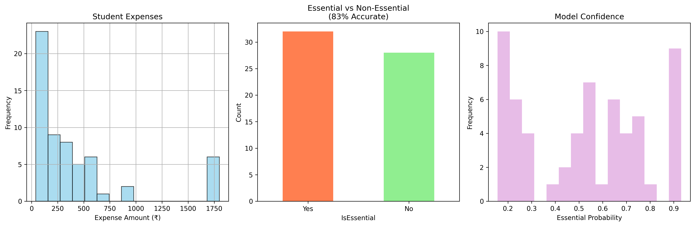

# Student Expense Optimizer (Mini Project)

## Overview
This project analyzes student spending data using machine learning techniques to identify spending patterns, predict expense amounts, and classify expenses as essential or non-essential.

## Tasks Performed
- **Clustering**: Grouped similar spending behaviors using K-Means.
- **Regression**: Predicted expense amounts using Random Forest Regression.
- **Classification**: Classified expenses as Essential vs Non-Essential.
- **Evaluation**: Used 5-fold cross-validation (RMSE for regression, Accuracy for classification).

## Tools & Technologies
- Python
- Pandas, NumPy
- Scikit-learn
- Matplotlib
- VS Code

## Visual Output

## Status
Completed as a mini project. Future extensions may include time-series forecasting.
